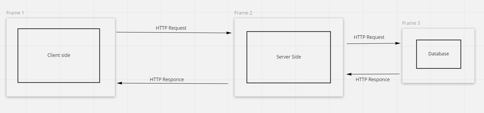
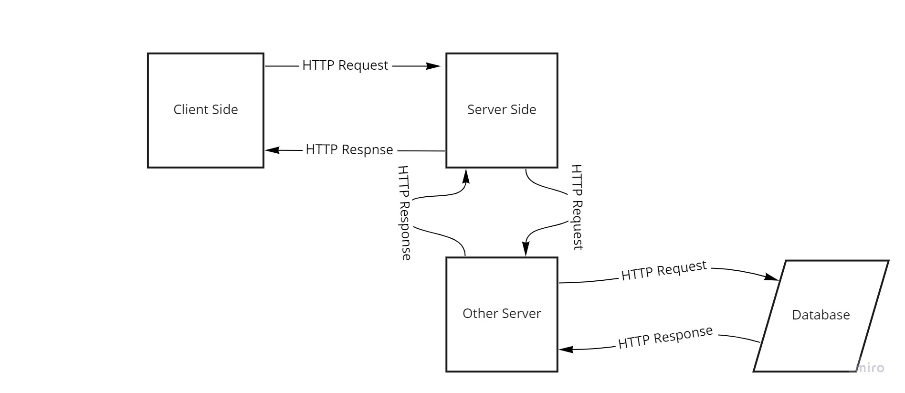
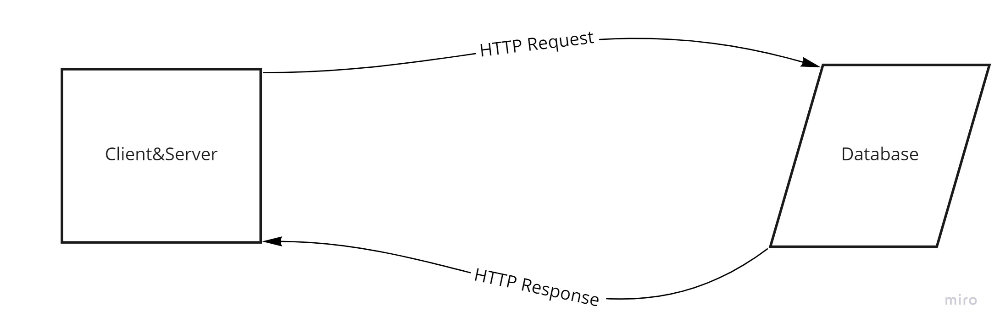
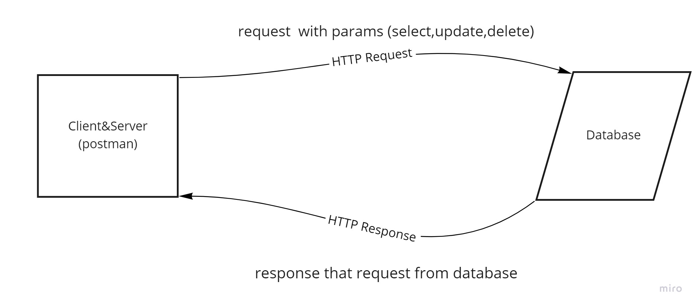

# Movies-Library

# Project Name - Project Version

**Author Name**: Waleed Alrefai

## WRRC

## Overview
An application that contains libraries for viewing movies

## Getting Started
1- make constructor and import requierd framework
2- make EndPoint and get data from 3rd API
3- Show Data with postman program
### Task13
1-create Database
2-add data for 3rd party API into database
3-git Data from Database to Browser
### Task14
1-select specific row or specific data from table in database
2-uppdate the data in database
3-delete the specific data in database

## Project Features
<!-- What are the features included in you app -->